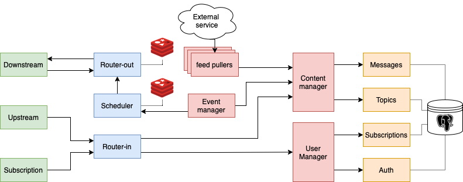
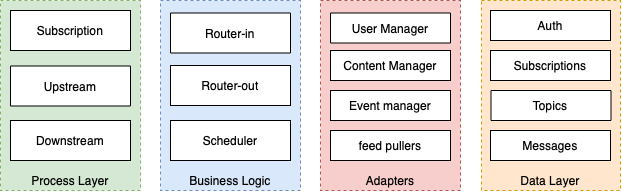
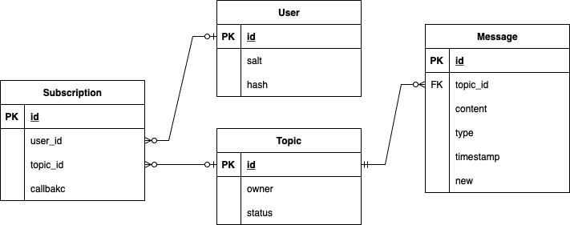

# NFeedS

## Architecture and description

<p align="center" >
    
</p>

### Components description

<p align="center">
    
</p>

#### Process Layer

- **Subscription** : Provide public APIs to create/delete a user and subscribe/unsubscribe to/from a topic.
- **Upstream** : Provide public APIs to create/delete topics and post new messages.
- **Downstream** : Provide public APIs to retrieve messages from a topic.

#### Business Logic

- **RouterIn** : Manage the incoming requests for new topics and messages redirecting them to the appropriate service after checking for authorization.
- **RouterOut** : Provides content in form of messages to the Downstream service, keeps also a temporary db of those messages.
- **Scheduler** : Is a filter layer between RouterOut and EventManager that decide which and when an event is sent downstream.

#### Adapters

- **ContentManager** : Abstract the management of Topics and Messages, adapt the structure of different types of messages to the general one used in the data layer.
- **EventManager** : Check for changes in the ContentManager and create a new message (event) to be sent downstream when a new message or topic is created.
- **UserManager** : Abstract the management of Users and Subscriptions, provides an endpoint to check the authorization.
- **Pullers** : Set of services that act as a client, but talk directly to ContentManager, they crawl content from an extarnal service and convert it in messages for a topic.

#### Data Layer

- **Auth** : Provides CRUD endpoints for the users table.
- **Topics** : Provides CRUD endpoints for the topics table.
- **Messages** : Provides CRUD endpoints for the messages table.
- **Subscriptions** : Provides CRUD endpoints for the subscriptions table.

### Database

<p align="center" >
    
</p>

### Endpoint requirements per module

<span style="color:CornflowerBlue">PUT</span>
<span style="color:ForestGreen">GET</span>
<span style="color:Coral">POST</span>
<span style="color:Crimson">DELETE</span>

#### DL-Subsriptions

- <span style="color:Coral">POST</span> new subscription
- <span style="color:ForestGreen">GET</span> all the subscriptions
- <span style="color:ForestGreen">GET</span> a subscription by id
- <span style="color:ForestGreen">GET</span> search subscriptions by user id
- <span style="color:CornflowerBlue">PUT</span> update a subscription
- <span style="color:Crimson">DELETE</span> a subscription

##### DL-Auth

- <span style="color:Coral">POST</span> new user
- <span style="color:ForestGreen">GET</span> all the users
- <span style="color:ForestGreen">GET</span> a user by id
- <span style="color:CornflowerBlue">PUT</span> update a user
- <span style="color:Crimson">DELETE</span> a user

##### DL-Topics

- <span style="color:Coral">POST</span> new topic
- <span style="color:ForestGreen">GET</span> all the topics
- <span style="color:ForestGreen">GET</span> a topic by id
- <span style="color:ForestGreen">GET</span> search topics by owner
- <span style="color:CornflowerBlue">PUT</span> update a topic
- <span style="color:Crimson">DELETE</span> a topic

##### DL-Messages

- <span style="color:Coral">POST</span> new message
- <span style="color:ForestGreen">GET</span> all the messages
- <span style="color:ForestGreen">GET</span> a message by id
- <span style="color:ForestGreen">GET</span> search messages by topic
- <span style="color:CornflowerBlue">PUT</span> update a message
- <span style="color:Crimson">DELETE</span> a message

#### Ad-UserManager

- <span style="color:Coral">POST</span> create user
- <span style="color:Coral">POST</span> add subscription
- <span style="color:ForestGreen">GET</span> validate auth
- <span style="color:ForestGreen">GET</span> get subscriptions by user
- <span style="color:ForestGreen">GET</span> user by id
- <span style="color:Crimson">DELETE</span> a user
- <span style="color:Crimson">DELETE</span> a subscription

#### Ad-ContentManager

- <span style="color:Coral">POST</span> add message
- <span style="color:Coral">POST</span> add topic
- <span style="color:ForestGreen">GET</span> messages by topic
- <span style="color:ForestGreen">GET</span> new messages by topic
- <span style="color:ForestGreen">GET</span> new messages
- <span style="color:ForestGreen">GET</span> topics
- <span style="color:Crimson">DELETE</span> a topic
- <span style="color:Crimson">DELETE</span> a message

#### Ad-EventManager


#### BL-RouterIn

- <span style="color:Coral">POST</span> create user
- <span style="color:Coral">POST</span> subscribe to a topic
- <span style="color:Coral">POST</span> unsubscribe from a topic
- <span style="color:Coral">POST</span> add message
- <span style="color:Coral">POST</span> add topic
- <span style="color:Coral">POST</span> close topic

#### BL-RouterOut

- <span style="color:Coral">POST</span> add events
- <span style="color:CornflowerBlue">PUT</span> update events callback by user+topic
- <span style="color:ForestGreen">GET</span> events by user

#### BL-Scheduler

- <span style="color:Coral">POST</span> schedule events

#### PL-Subscription

- public : <span style="color:Coral">POST</span> create user
- public : <span style="color:Coral">POST</span> subscribe to a topic
- public : <span style="color:Coral">POST</span> unsubscribe from a topic

#### PL-Upstream

- public : <span style="color:Coral">POST</span> add message
- public : <span style="color:Coral">POST</span> add topic
- public : <span style="color:Coral">POST</span> close topic

#### PL-Downstream

- <span style="color:Coral">POST</span> send message
- public : <span style="color:ForestGreen">GET</span> events by user
- public : <span style="color:Coral">POST</span> overwrite callback

### Concepts

- **user** : an entry in the User table, has an identifier and an access token, validated doing an hash on the combination salt:token.
- **topic** : an entry in the Topic table, identify a set of messages, has an owner (which is a user) and can be open or closed, the creation of a new topic trigger an automatic message in the system default topic..
- **default topic** : is a special type of topic created automatically for each user, messages can be pushed without specifying a topic, the creation of a default topic doesn't trigger any event..
- **system default topic** : is the main topic of the system, not tied to an owner and message cannot be pushed from the outside, it hosts messages created automatically, such as the creation of a new topic. 
- **message** : It's an item belonging to a topic and pushed by a user, it has a content and a type.
- **event** : is an abstract item created by EventManager in response to new messages or new topics, it's then sent towards Downstream to be sent to the user, it has a content, a topic, a type, a firetime, and it's not stored for long term.

### Processes

#### New User

When a client want to create a new user in the system and receive an auth token to push messages and create topics it calls the appropriate endpoint exposed by **Subscription** (tbd).
**Subscription** validates the value of the request and passes it to **Router-In**, which in this case request the creation of a new user from **UserManager**.
At this point **UserManager** checks if the user is not already present, if it is, it returns an error and the procedure is aborted, the client will receive a bad request error.
If the user is successfully created then an auth token is created and returned at the end; now **Router-In** follow up creating a default topic for the user and subscribing it to the system default topic.


---
## Project

### Technologies

- Java 17
- maven 4.0.0
- Spring Boot 3.0.2
- Postgres
- Docker

### Folder organization

Each module described in the architecture has it's own spring boot project.

The components of the service are divided in : Process Layer, Business Logic, Adapters, Data Layer.

To specify to which category a component belongs to the name of the project folder has one of the following prefix:
- Ad : Adapter
- BL : Business Logic
- DL : Data layer
- PL : Process layer

The folder structure is as follow:

```
NFeedS
|-- Misc
|-- modules
    |-- Adapters
    |-- BusinessLogic
    |-- DataLayer
    |-- ProcessLayer
```

In the Misc folder there are all the scripts and configuration files to clone and make the app run.
While in the modules folder (create automatically after running the cloning script) there is the source code of each
component of the service.

### Dependencies

In this section are listed the maven dependencies used for each component category, in addition each project has the 
following dependencies:

```xml
<dependency>
    <groupId>org.springframework.boot</groupId>
    <artifactId>spring-boot-starter-web</artifactId>
</dependency>

<dependency>
    <groupId>org.projectlombok</groupId>
    <artifactId>lombok</artifactId>
</dependency>

<dependency>
    <groupId>org.springframework.boot</groupId>
    <artifactId>spring-boot-starter-actuator</artifactId>
</dependency>

<dependency>
    <groupId>com.lm.wrapper.http</groupId>
    <artifactId>HttpWrapper</artifactId>
    <version>1.0</version>
</dependency>
```

#### Adapter

#### Data layer

```xml
<dependency>
    <groupId>org.springframework.boot</groupId>
    <artifactId>spring-boot-starter-data-jpa</artifactId>
</dependency>

<dependency>
    <groupId>org.springframework.boot</groupId>
    <artifactId>spring-boot-starter-data-rest</artifactId>
</dependency>

<dependency>
    <groupId>org.postgresql</groupId>
    <artifactId>postgresql</artifactId>
    <scope>runtime</scope>
</dependency>
```

#### Business Logic

#### Process Layer

```xml
<dependency>
    <groupId>org.springdoc</groupId>
    <artifactId>springdoc-openapi-ui</artifactId>
    <version>1.6.15</version>
</dependency>
```

#### About HttpWrapper

HttpWrapper is a library built around the standard Http java library, it provides a number of wrapper functions to build an http request.
To build the project it has to be cloned from github and installed in a local maven repository.

